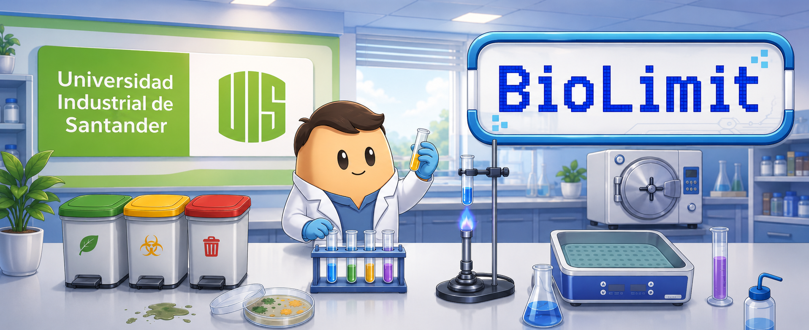

# Biolimit



Biolimit es un videojuego serio 2D, de puzzles cortos y enfoque educativo, desarrollado en Unity para apoyar la adherencia a las normas de bioseguridad en laboratorios de Microbiología y Bioanálisis. El objetivo principal es apoyar la adherencia a las normas de bioseguridad, mediante permitir que los estudiantes reiteren la aplicación de buenas prácticas de seguridad en un entorno didáctico semejante al de los laboratorios.

## Descripción del proyecto

- Tipo de juego: Videojuego serio 2D, orientado a la educación y al aprendizaje.
- Género: Puzzles interactivos de tipo point and click y point and drag.
- Plataforma objetivo: Android y Windows.
- Modalidad: Single-player.

## Demostración


> Puedes reemplazar esta imagen por un GIF real de gameplay en el futuro.

## Características principales

- Gameplay 2D basado en la búsqueda y resolución de puzzles.
- Experiencia de aprendizaje basada en normas de bioseguridad.
- Mecánicas de interacción por point and click y point and drag.
- Diseño enfocado en un jugador (single-player).
- Propuesta educativa para el refuerzo de buenas prácticas en laboratorios.

## Cómo jugar

### Windows 10

- Teclado:
  - WASD o flechas de dirección para moverse.
  - Mouse para interactuar con los puzzles.

### Android

- Pantalla táctil.
- Joystick en pantalla para desplazarse.
- Tocar la pantalla para interactuar con los elementos del juego.

## Versión de Unity

El presente proyecto fue desarrollado en la versión 6000.3.2f1 de Unity.

## Instalación

### Windows 10

1. Entrar al siguiente enlace: [Página web de Itch.io del proyecto](https://fitman22.itch.io/Biolimit)
2. Descargar el ejecutable correspondiente a Windows.
3. Extraer el archivo comprimido.
4. Entrar a la carpeta descargada.
5. Hacer doble clic en el ejecutable "Bio Limit.exe".

### Android

1. Entrar al siguiente enlace: [Página web de Itch.io del proyecto](https://fitman22.itch.io/Biolimit)
2. Descargae el instalador para Android.
3. En tu dispositivo, entrae a Ajustes y permitir instalaciones de origen desconocido desde el explorador de archivos.
4. Abrir el explorador de archivos, seleccionar el instalador y hacer tap para instalarlo.
5. Buscar el juego en el menú del teléfono Android.

## Assets externos utilizados

- IA generativa: Gemini AI y ChatGPT fueron usados para la creación y apoyo en assets visuales.
- Artista: Norbelly Cecilia Sepúlveda Garzón, quien permitió el uso de assets que sirvieron para la construcción del mundo del juego.

## Estructura de carpetas

```text
README.md
Docs
├─ class_diagram
├─ sequence_diagram
├─ use_case_diagram
└─ RUP
Unity_project
└─ Mycrobiology_project
    ├─ Assets
    │   ├─ Animations
    │   ├─ Controls
    │   ├─ Firebase
    │   ├─ Imports
    │   │   ├─ Thaleah_PixelFont
    │   │   └─ TextMesh Pro
    │   ├─ Prefabs
    │   ├─ Puzzles
    │   │   ├─ Commons
    │   │   └─ PuzzlesByLevel
    │   │       └─ Level1
    │   ├─ Resources
    │   ├─ Scenes
    │   ├─ Scripts
    │   │   ├─ AbstractClasses
    │   │   ├─ GameManager
    │   │   ├─ Interfaces
    │   │   ├─ Login
    │   │   ├─ Player
    │   │   ├─ PuzzleCompletionCheckZone
    │   │   ├─ Puzzles
    │   │   ├─ Raycaster
    │   │   ├─ ScoreManager
    │   │   ├─ Sounds
    │   │   └─ UIElements
    │   ├─ Songs
    │   └─ Sprites
    │       ├─ UI
    │       └─ WorldBuilding
    ├─ Packages
    ├─ ProjectSettings
    ├─ Library
    ├─ Logs
    ├─ Temp
    └─ UserSettings
```

## Documentación del proyecto

La documentación del proyecto se encuentra en la carpeta [Docs](Docs), donde se puede encontrar:

- Diagramas de clase
- Diagramas de secuencia
- Diagramas de arquitectura
- Diagramas de casos de uso
- Evidencias del uso de la metodología RUP

## Repositorio y desarrollo

Este repositorio contiene el proyecto completo de Biolimit, incluyendo el desarrollo de Unity, los assets, las escenas, los scripts en C#, prefabs, ScriptableObjects y otros elementos necesarios para ejecutar y extender el juego.

## Equipo de desarrollo y control

### Autores
- Andrés Felipe Muñoz Aguilar - 2210087 (Ingeniería de Sistemas)
- Brandon David Jaimes Castro - 2211859 (Ingeniería de Sistemas)

### Director de proyecto
- Urbano Eliécer Gómez Prada; Dr. en Tecnología Educativa y Mgtr. en Informática y Ciencias de la Computación.

### Tutora de proyecto
- Giovanna Rincón Cruz; Dra. en el área de Farmacia y bioquímica y Msc. en Ciencias de Microbiología.

