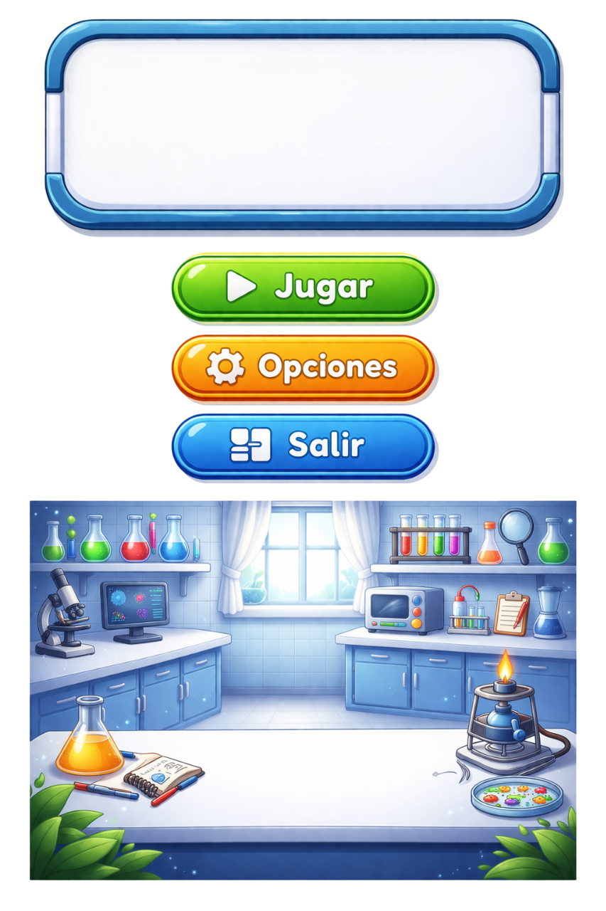

# Biolimit



Biolimit es un videojuego serio 2D, de pequeños puzzles y enfoque educativo, desarrollado en Unity para apoyar la adherencia a las normas de bioseguridad en laboratorios de microbiología y bioanálisis. El objetivo principal es que los estudiantes puedan repasar y reforzar buenas prácticas de seguridad mientras interactúan con un entorno inmersivo y didáctico.

## Descripción del proyecto

- Tipo de juego: videojuego serio 2D, orientado a la educación y al aprendizaje.
- Género: puzzles interactivos de tipo point and click y point and drag.
- Plataforma objetivo: Android y Windows 10.
- Modalidad: single-player.

## Demostración


> Puedes reemplazar esta imagen por un GIF real de gameplay en el futuro.

## Características principales

- Gameplay 2D con exploración y resolución de puzzles.
- Experiencia de aprendizaje basada en normas de bioseguridad.
- Mecánicas de interacción por point and click y point and drag.
- Diseño enfocado en un jugador (single-player).
- Propuesta educativa para el refuerzo de buenas prácticas en laboratorios.

## Cómo jugar

### Windows 10

- Teclado:
  - WASD o flechas de dirección para moverse.
  - Mouse para interactuar con los puzzles.

### Android

- Pantalla táctil.
- Joystick en pantalla para desplazarse.
- Tocar la pantalla para interactuar con los elementos del juego.

## Versión de Unity

Este proyecto fue desarrollado con Unity versión 6000.3.2f1.

## Instalación

### Windows 10

1. Dirígete al siguiente enlace: https://fitman22.itch.io/Biolimit
2. Descarga el ejecutable correspondiente a Windows.
3. Extrae el archivo comprimido.
4. Entra a la carpeta descargada.
5. Haz doble clic en el ejecutable Bio Limit.exe.

### Android

1. Dirígete al siguiente enlace: https://fitman22.itch.io/Biolimit
2. Descarga el instalador para Android.
3. En tu dispositivo, entra a Ajustes y permite instalaciones de origen desconocido desde el explorador de archivos.
4. Abre el explorador de archivos, selecciona el instalador y dale tap para instalarlo.
5. Busca el juego en el menú de tu teléfono Android.

## Assets externos utilizados

- IA generativa: Gemini AI y ChatGPT para la creación y apoyo en assets visuales.
- Artista: Norbelly Cecilia Sepúlveda Garzón, quien permitió el uso de assets para la construcción del mundo del juego.

## Estructura de carpetas

```text
README.md
Docs/
  class_diagram/
  sequence_diagram/
  use_case_diagram/
  RUP/
Unity_project/
  Mycrobiology_project/
    Assets/
    Packages/
    ProjectSettings/
    Library/
    Logs/
    Temp/
    UserSettings/
```

## Documentación del proyecto

La documentación del proyecto se encuentra en la carpeta [Docs](Docs), donde puedes encontrar:

- Diagramas de clase
- Diagramas de secuencia
- Diagramas de arquitectura
- Diagramas de casos de uso
- Evidencias de la metodología RUP

## Repositorio y desarrollo

Este repositorio contiene el proyecto completo de Biolimit, incluyendo el desarrollo de Unity, los assets, las escenas, los scripts en C#, prefabs, ScriptableObjects y otros elementos necesarios para ejecutar y extender el juego.
